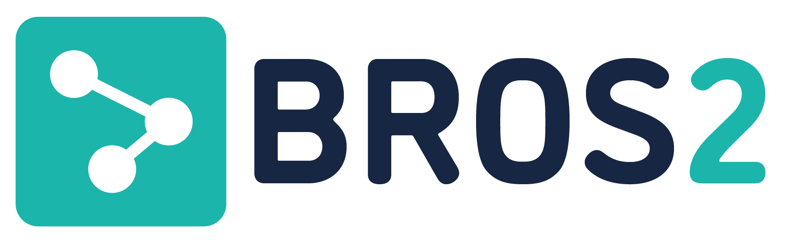

<p align="center">
  
</p>

BROS2 (Block ROS2) is an Electron desktop environment for building, simulating, and introspecting ROS2 graphs with a drag-and-drop block interface. It streamlines going from idea to runnable robot behavior by generating ROS packages, launch files, and providing live insight into running nodes.

Basically, BROS2 (Block ROS2) is an Electron desktop app that lets you assemble ROS2 graphs visually and run them through a managed Docker workspace 🦾🤖

## Why BROS2?
- Visual composition of ROS 2 nodes, topics, and services without leaving the editor.
- Automatic generation of package scaffolding and launch files from the block graph.
- Integrated simulation hooks (Gazebo, Isaac) and telemetry panels for rapid iteration.
- Cross-platform desktop app distributed via Electron so teams share a single workflow.

## Requirements
- macOS (Apple Silicon or Intel) or Linux with Docker Desktop / Docker Engine running.
- Git, curl, and bash (used by the bootstrap script).
- Internet access to download Node, pnpm, and Electron during setup.

Verify Docker access before continuing:

```bash
docker ps
```

## First-Time Setup

```bash
git clone https://github.com/nhathout/BROS2.git
cd BROS2
./apps/desktop-app/scripts/bootstrap.sh
```

The bootstrap script installs or activates:
- `nvm` (if missing) and Node `20.19.0`.
- pnpm `10.17.1` via Corepack (or npm fallback).
- Workspace dependencies with `pnpm install -r`.
- Electron binaries and a first build of the desktop app.

It launches the packaged app once everything compiles. If the script adds an `nvm use` snippet to your shell profile, open a new terminal so `pnpm` is on your `PATH` next time.

## Daily Development

From a bootstrapped workspace, start the dev environment from the desktop app folder:

```bash
cd apps/desktop-app
node node_modules/electron/install.js  
pnpm dev
```

`pnpm dev` runs the Electron main process (`dev:main`) and the Vite renderer (`dev:renderer`) concurrently. Keep this terminal open while developing. You can also run the same command from the repo root with `pnpm --filter ./apps/desktop-app dev`.

If you pull dependency changes later, refresh them with:

```bash
pnpm install -r
```

## ROS 2 Dev Notes

The preload bridge exposes `window.runner` for Docker-backed ROS 2 sessions and `window.ir` for graph validation.

```ts
window.runner.up(projectName: string): Promise<void>;
window.runner.exec(command: string): Promise<{ stdout: string; stderr: string; code: number }>;
window.runner.down(): Promise<void>;

window.ir.build(graph: BlockGraph): Promise<{ ir: IR; issues: string[] }>;
window.ir.validate(ir: IR): Promise<{ errors: Issue[]; warnings: Issue[] }>;
```

### Runner sanity check (DevTools)

With Docker running and the app in dev mode, open DevTools (`View → Toggle Developer Tools`) and run:

```js
await window.runner.up("hello_ros");
await window.runner.exec("ros2 --help");
await window.runner.exec("ros2 pkg list | head -n 5");
await window.runner.down();
```

This spins up the `bros_hello_ros` container defined in `Projects/hello_ros` and exercises the ROS 2 CLI.

### IR build + validation example

```js
const graph = {
  blocks: [
    { kind: "node", id: "talker", name: "talker" },
    { kind: "publish", nodeId: "talker", topic: "/chatter", type: "std_msgs/msg/String" },
  ],
};

const { ir, issues } = await window.ir.build(graph);
const { errors, warnings } = await window.ir.validate(ir);
console.log({ issues, errors, warnings });
```

## Cleaning

Wipe compiled artifacts across every workspace when you need a fresh build:

```bash
pnpm -r clean
```

To reset dependencies as well:

```bash
pnpm store prune
rm -rf node_modules
pnpm install -r
```

After cleaning, rerun `pnpm dev` (or `./apps/desktop-app/scripts/bootstrap.sh`) to rebuild the app.

## Tips
- Keep Docker running whenever you use `window.runner.*`; the runner manages containers in `Projects/`.
- If `pnpm dev` fails because Electron is missing, re-run `node node_modules/electron/install.js`.
- Rerun the bootstrap script after major Node/pnpm upgrades—it is idempotent and safe to run again.
