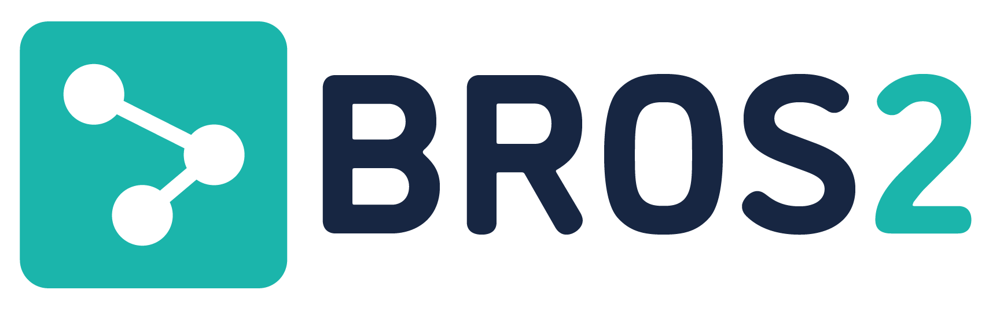

<p align="center">
  
</p>

BROS2 (Block ROS2) is an Electron desktop environment for building, simulating, and introspecting ROS2 graphs with a drag-and-drop block interface. It streamlines going from idea to runnable robot behavior by generating ROS packages, launch files, and providing live insight into running nodes.

Basically, BROS2 (Block ROS2) is an Electron desktop app that lets you assemble ROS2 graphs visually and run them through a managed Docker workspace 🦾🤖

## Why BROS2?
- Visual composition of ROS 2 nodes, topics, and services without leaving the editor.
- Automatic generation of package scaffolding and launch files from the block graph.
- Integrated simulation hooks (Gazebo, Isaac) and telemetry panels for rapid iteration.
- Cross-platform desktop app distributed via Electron so teams share a single workflow.

## Requirements
- macOS (Apple Silicon or Intel) or Linux with Docker Desktop / Docker Engine running.
- Git, curl, and bash (used by the bootstrap script).
- Internet access to download Node, pnpm, and Electron during setup.

Verify Docker access before continuing:

```bash
docker ps
```

## Quick Dev Loop

1. Select Node 20.19.x

   ```bash
   source ~/.nvm/nvm.sh
   nvm use 20.19.0
   ```

2. Refresh deps (clean if things feel stale):

   ```bash
   pnpm install -r
   pnpm -r clean   # optional, only if builds seem out of date
   ```

   If you did clean, run the workspace builds in the Daily Development section (step 3) before moving on below.

3. Build the ROS image once per machine (safe to rerun):

   ```bash
   pnpm --filter ./apps/desktop-app ros:build-image
   ```

4. Regenerate the Electron main + preload bundle (needed after a clean):

   ```bash
   pnpm --filter ./apps/desktop-app build:main
   ```

5. Launch the desktop dev stack (Electron main + Vite renderer):

   ```bash
   pnpm --filter ./apps/desktop-app dev
   ```

6. In Electron DevTools, bring up ROS 2 + rosbridge when you need it:

   ```js
   await window.runner.up("hello_ros");
   await window.runner.exec('bash -lc "source /opt/ros/humble/setup.bash && ros2 launch rosbridge_server rosbridge_websocket_launch.xml"');
   ```

Skip to the sections below for the full workflow details and tests.

## First-Time Setup

```bash
git clone https://github.com/nhathout/BROS2.git
cd BROS2
./apps/desktop-app/scripts/bootstrap.sh
```

The bootstrap script installs or activates:
- `nvm` (if missing) and Node `20.19.0`.
- pnpm `10.17.1` via Corepack (or npm fallback).
- Workspace dependencies with `pnpm install -r`.
- Electron binaries and a first build of the desktop app.

It launches the packaged app once everything compiles. If the script adds an `nvm use` snippet to your shell profile, open a new terminal so `pnpm` is on your `PATH` next time.

## Daily Development

1. **Select Node 20.19.x** (every new shell resets your `nvm` version):

   ```bash
   source ~/.nvm/nvm.sh
   nvm use 20.19.0
   ```

2. **Refresh dependencies** after pulling changes (rerun `pnpm -r clean` first if builds look stale):

   ```bash
   pnpm install -r
   ```

3. **Build the workspace libraries** (run this after changing any of these packages so their `.d.ts` files stay fresh for Electron main):

   ```bash
   pnpm --filter @bros2/runtime build
   pnpm --filter @bros2/shared build
   pnpm --filter @bros2/ui build
   pnpm --filter @bros2/validation build
   pnpm --filter @bros2/runner build
   ```

4. **Keep the ROS runner image up to date** (once per machine, rerun after touching `packages/services/runner/images/ros2-humble`):

   ```bash
   pnpm --filter ./apps/desktop-app ros:build-image
   ```

5. **Emit the desktop main + preload bundle** (run from the repo root).  
_Do not skip this step after running `pnpm -r clean`; it regenerates the preload bridges and the runtime registry that power `window.runtime`._

   ```bash
   pnpm --filter ./apps/desktop-app build:main
   ```

   (Optional) Build the renderer bundle for production checks — also from the repo root:

   ```bash
   pnpm --filter ./apps/desktop-app build:renderer
   ```

6. **Start the dev environment** (Electron main + Vite renderer):

   ```bash
   pnpm --filter ./apps/desktop-app dev
   ```

   Keep this process running while you iterate. You can still `cd apps/desktop-app && pnpm dev`, but the filtered form avoids path mistakes. After Electron opens, pop open DevTools and run `typeof window.runtime`—it should log `"object"` if the preload bridges built correctly.

If Electron complains about missing binaries, reinstall them once:

```bash
cd apps/desktop-app
node node_modules/electron/install.js
```

## ROS 2 Dev Notes

The preload bridge exposes `window.runner` for Docker-backed ROS 2 sessions and `window.ir` for graph validation.

```ts
window.runner.up(projectName: string): Promise<void>;
window.runner.exec(command: string): Promise<{ stdout: string; stderr: string; code: number }>;
window.runner.down(): Promise<void>;

window.ir.build(graph: BlockGraph): Promise<{ ir: IR; issues: string[] }>;
window.ir.validate(ir: IR): Promise<{ errors: Issue[]; warnings: Issue[] }>;
```

### Runner sanity check (DevTools)

With Docker running and the app in dev mode, open DevTools (`View → Toggle Developer Tools`) and run:

```js
await window.runner.up("hello_ros");
await window.runner.exec("ros2 --help");
await window.runner.exec("ros2 pkg list | head -n 5");
await window.runner.down();
```

This spins up the `bros2_hello_ros` container defined in `Projects/hello_ros` and exercises the ROS 2 CLI.

### IR build + validation example

```js
const graph = {
  blocks: [
    { kind: "node", id: "talker", name: "talker" },
    { kind: "publish", nodeId: "talker", topic: "/chatter", type: "std_msgs/msg/String" },
  ],
};

const { ir, issues } = await window.ir.build(graph);
const { errors, warnings } = await window.ir.validate(ir);
console.log({ issues, errors, warnings });
```

### Runtime bridge smoke test (ArrowKeyPub + ConsoleSub)

The preload now exposes `window.runtime` alongside the runner and IR bridges. With the dev app running:

```js
typeof window.runtime; // "object"
const pubId = window.runtime.create("ArrowKeyPub", { topic: "keys/arrows" });
const subId = window.runtime.create("ConsoleSub", { topic: "keys/arrows" });
window.runtime.start(pubId);
window.runtime.start(subId);
// Press arrow keys while the Electron window is focused:
// [publish] keys/arrows <- { key: "left", ts: ... }
// [node:ConsoleSub_1] received from ArrowKeyPub_1: {"key":"left","ts":...}
window.runtime.stop(subId);
window.runtime.stop(pubId);
window.runtime.list(); // ["ArrowKeyPub_1", "ConsoleSub_1"]
```

If `window.runtime` is missing, run `pnpm --filter ./apps/desktop-app build:main` again to regenerate the preload bridges.

### API cheatsheet (DevTools)

- `window.runner.up(projectName)` – start/update the Docker container `bros2_<projectName>` backed by `bros2/ros2-humble:latest`.
- `window.runner.exec(command)` – run commands like `ros2 topic list` or launching rosbridge:

  ```js
  await window.runner.exec('bash -lc "source /opt/ros/humble/setup.bash && ros2 launch rosbridge_server rosbridge_websocket_launch.xml"');
  ```

- `window.runner.down()` – stop/remove the ROS 2 container.
- `window.runtime.create(type, config)` – instantiate nodes registered in `apps/desktop-app/src/renderer/runtime/registry.ts` (`ArrowKeyPub`, `ConsoleSub`, `RosbridgeBridge`, `Forwarder`).
- `window.runtime.start(id)`, `window.runtime.stop(id)`, `window.runtime.stopAll()` – control renderer-runtime nodes.
- `window.ir.build(...)` / `window.ir.validate(...)` – convert block graphs to IR and run validators.
- `globalThis.__rosbridge__` – dev-only handle populated by `RosbridgeBridge` with helpers like `publishRos(topic, msg)`.

## Cleaning & Full Rebuild

1. Remove build outputs everywhere (this clears `dist/` folders and `tsconfig.main.tsbuildinfo`, ensuring the desktop main bundle re-emits `dist/main.js`):

   ```bash
   pnpm -r clean
   ```

2. Reset dependencies if things get out of sync:

   ```bash
   pnpm store prune   # optional
   rm -rf node_modules
   pnpm install -r
   ```

3. Rebuild the workspaces and desktop app using the daily workflow above. When `build:main` completes you should have:

   ```
   apps/desktop-app/dist/main.js
   apps/desktop-app/dist/preload.js
   apps/desktop-app/dist/remote/runtime-bridge.cjs
   apps/desktop-app/dist/renderer/runtime/registry.js
   ```

4. (Optional) Produce installers:

   ```bash
   pnpm -r build
   ```

## Supporting docs

- [`apps/desktop-app/README.md`](apps/desktop-app/README.md) – ROS 2 quickstart snippet, DevTools walkthrough, and desktop-specific scripts.
- [`packages/services/runner/images/ros2-humble/README.md`](packages/services/runner/images/ros2-humble/README.md) – maintenance notes for the Docker image used by `window.runner`.

## Tips
- Keep Docker running whenever you use `window.runner.*`; the runner manages containers in `Projects/`.
- If `pnpm dev` fails because Electron is missing, re-run `node node_modules/electron/install.js`.
- Rerun the bootstrap script after major Node/pnpm upgrades—it is idempotent and safe to run again.
